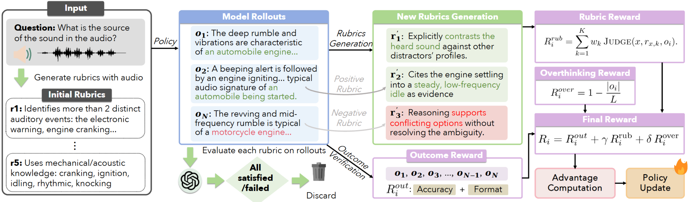

<h1 align="center">
  Reinforcement Learning with Evolving Rubrics as Rewards for Audio Reasoning
</h1>

<p align="center">
  📄 <a href="https://arxiv.org/abs/2608.02831"><strong>Paper</strong></a> |
  🤗 <a href="https://huggingface.co/umd-zhou-lab/AudioRubrics"><strong>Model</strong></a> |
  🤗 <a href="https://huggingface.co/datasets/umd-zhou-lab/AVQA-Audio-Rubrics"><strong>Rubric Dataset</strong></a>
</p>

<p align="center">
  <a href="https://yu-fangxu.github.io/">Fangxu Yu</a><sup>1</sup>,
  <a href="https://ft2023.github.io/taofeng.github.io/">Tao Feng</a><sup>2</sup>,
  <a href="https://zhishanq.github.io/">Dehai Min</a><sup>3</sup>,
  <a href="https://zinanlin.me/">Zinan Lin</a><sup>4</sup>,
  <a href="https://www.microsoft.com/en-us/research/people/weijiaxu/">Weijia Xu</a><sup>4</sup>
  <br>
  <a href="https://cs.uic.edu/profiles/philip-yu/">Philip S. Yu</a><sup>3</sup>,
  <a href="https://siebelschool.illinois.edu/about/people/all-faculty/geliu">Ge Liu</a><sup>2</sup>,
  <a href="https://tianyizhou.github.io/">Tianyi Zhou</a><sup>5</sup>,
</p>

<p align="center">
  <sup>1</sup>University of Maryland, College Park &nbsp;
  <sup>2</sup>University of Illinois Urbana-Champaign &nbsp;
  <sup>3</sup>University of Illinois Chicago &nbsp;
  <sup>4</sup>Microsoft Research &nbsp;
  <sup>5</sup>Mohamed Bin Zayed University of Artificial Intelligence
</p>



## 🔥 Overview

**AudioRubrics** is a reinforcement learning framework that supervises audio reasoning with **self-evolving, audio-grounded rubric rewards**.

Outcome-based rewards supervise only the final answer and let the model reach it without genuinely attending to the audio, whereas existing process-based rewards rely on coarse, hand-crafted, and fixed criteria that neither adapt to each question nor stay grounded in the acoustic evidence. AudioRubrics synthesizes per-sample rubrics **from the raw waveform** and, conditioned on the model's own rollouts, **regenerates and reweights criteria each group** to keep supplying signal exactly where an outcome-only reward is flat: a judge evaluates every rubric on the rollout group, a variance filter prunes non-discriminative criteria, and new criteria (with positive/negative polarity) are distilled from the model's current failure modes. The rubric score is combined with the accuracy reward and a linear **overthinking penalty** for GRPO optimization:

$$R = R_{\text{outcome}} + \gamma \cdot R_{\text{rubric}} + \delta \cdot R_{\text{overthinking}}$$

## 🚀 Key Features

- 🎧 **Audio-grounded rubrics**: every criterion is generated from the raw waveform rather than a transcript, so the reward verifies that the reasoning is anchored in acoustic evidence actually present in the clip.
- 🔄 **Self-evolving supervision**: rubrics are regenerated and reweighted from the model's own rollouts each group, so the evaluation standard keeps rising as the policy improves instead of saturating like a fixed criterion.
- ⚖️ **Stable reasoning length**: the overthinking penalty counterbalances the rubric reward, converging to a stable reasoning length that avoids both degenerate collapse (outcome-only GRPO) and runaway verbosity (rubric-only).

## 🖥️ Installation

```bash
conda create -n audiorubrics python=3.11 -y
conda activate audiorubrics
bash setup.sh            # or: pip install -r requirements.txt
```

Training requires flash-attention-2 and DeepSpeed (ZeRO-3 config in `src/local_scripts/zero3.json`). The file `transformers/modeling_qwen2_5_omni.py` is a small runtime patch for pure-audio inputs; the training script copies it over the installed `transformers` package automatically.

## 📥 Download the Data

Training data is drawn from [AVQA](https://huggingface.co/datasets/gijs/avqa-processed): audio is extracted from the videos and audio–text pairs are constructed by replacing "video" with "audio" in the questions, yielding 40k training samples. Two files are needed (see `data/avqa/README.md` for the exact formats):

```
data/avqa/train_with_rubrics.json    # training samples (question / answer / audio path)
rubrics_avqa_train.jsonl             # 5 weighted static rubrics per sample, generated from the raw waveform
```

The full static-rubric annotation set (40,380 samples) is available at [umd-zhou-lab/AVQA-Audio-Rubrics](https://huggingface.co/datasets/umd-zhou-lab/AVQA-Audio-Rubrics). The rubric-generator / judge prompt is in `data/evolving_rubric_system_prompt.md`, and `data/sample_logs/` contains a sample of the per-step rubric-evolution logs (which rubrics were generated, kept, judged, and reweighted at each step).

## 🎯 Train AudioRubrics

Set your judge API key, point the script at the base model and the rubric file, then launch:

```bash
export GEMINI_API_KEY=...           # judge / rubric-generator API key (or GEMINI_API_KEYS=key1,key2)
MODEL_PATH=/path/to/Qwen2.5-Omni-7B \
RUBRIC_PATH=/path/to/rubrics_avqa_train.jsonl \
RUBRIC_WEIGHT=0.5 OVERTHINK_WEIGHT=0.15 MAX_STEPS=400 \
bash scripts/run_evolve_overthink.sh
```

Useful options:

```bash
NPROC=4                              # number of GPUs
RUBRIC_JUDGE_MODEL=gemini-3.1-pro-preview
JUDGE_BACKEND=trapi                  # switch the judge to any Azure-OpenAI-compatible endpoint
                                     # (with TRAPI_ENDPOINT / TRAPI_TOKEN_FILE)
```

After training, merge the thinker checkpoint back into a full Omni model for serving:

```bash
python scripts/merge_thinker_to_full.py --ckpt_dir <checkpoint> --orig_dir <base_model> --out_dir <merged>
```

## 📊 Evaluation

AudioRubrics is evaluated on [MMAU Test-mini](https://sakshi113.github.io/mmau_homepage/), [MMAR](https://github.com/ddlBoJack/MMAR), and [MMSU](https://huggingface.co/datasets/ddwang2000/MMSU). Serve the merged model with [vLLM](https://github.com/vllm-project/vllm), generate answers, then score:

```bash
vllm serve <merged_model> --served-model-name omni --trust-remote-code \
  --max-model-len 8192 --limit-mm-per-prompt '{"audio":1}'
python scripts/eval/generate_answers_vllm.py --base_url http://localhost:8000/v1 --model omni \
  --input <benchmark.jsonl> --audio_dir <audio_dir> --output <pred.jsonl> --max_new_tokens 768
python scripts/eval/evaluation.py --input <pred.jsonl>
```

`scripts/eval/eval_ckpts_3benchmarks.sh` automates this loop over checkpoints for all three benchmarks.

## 📖 Citation

If you find this work useful, please cite:

```bibtex
@article{yu2026reinforcement,
  title={Reinforcement Learning with Evolving Rubrics as Rewards for Audio Reasoning},
  author={Yu, Fangxu and Feng, Tao and Min, Dehai and Lin, Zinan and Xu, Weijia and Xu, Michael and Yu, Philip S and Liu, Ge and Zhou, Tianyi},
  journal={arXiv preprint arXiv:2608.02831},
  year={2026}
}
```

## 🙏 Acknowledgements

The training framework is built on [Omni-R1](https://github.com/aim-uofa/Omni-R1); we thank the authors for open-sourcing it. Base model: [Qwen2.5-Omni](https://huggingface.co/Qwen/Qwen2.5-Omni-7B).
